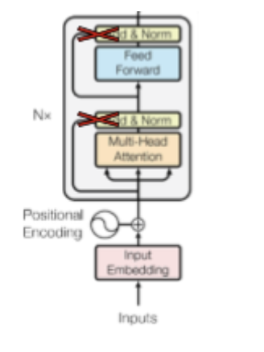

# Assignment 3

**Stony Brook University**  
**CSE538 - Spring 2025**  
**Assigned:** 04/03/2025  
**Due:** 04/20/2025 11:59pm

---

## Overview

- **Part I. Autoregressive and Auto-Encoding Transformer LM (40 Points)**
    - 1.1 Find the zero-shot accuracy of distil-gpt2 on boolQ (10 points)
    - 1.2 Finetune the distil-gpt2 LM on boolQ language (10 points)
    - 1.3 Compute the zero-shot accuracy on boolQ language (5 points)
    - 1.4 Task fine-tune distilRoberta for boolQ and compute accuracy (15 points)
- **Part II. Deeper into Transformer LM with Attention Mods (40 Points)**
    - 2.1 Modify the transformer distilRoberta (15 points)
    - 2.2 Task fine-tune distilRoberta & variants for classification and compute accuracy (10 points)
    - 2.3 Task fine-tune distilRoberta & variants for regression and compute accuracy (15 points)
    - 2.4 Extra Credit: Improve the architecture (up to 10 points)
- **Part III. Application: Context-based Response Generation (20 Points)**
    - 3.1 Context retrieval using Sentence Transformer (10 points)
    - 3.2 Generate answers based on retrieved context (10 points)

#### Objectives:
- Work with pre-trained transformer LMs
- Fine-tune LMs
- Language Model fine-tuning
- Task fine-tuning
- Familiarize oneself with coding self-attention by altering it
- Use an LM to retrieve context and generate content

---

## Code Structure

In previous assignments, the function signatures specified under a task were provided as guidance. However, for this assignment, you are free to structure the code as you see fit. Please ensure that you clearly mark the sections and checkpoints. The files linked below provide an outline/template for your reference, but it's not required to follow it.

- Part I: [`a3_p1_lastname_id.py`](https://drive.google.com/file/d/19B39DvtPTcHJziPjVVH5SeH6if4R7Gk-/view)
- Part II: [`a3_p2_lastname_id.py`](https://drive.google.com/file/d/1ePsJEoqhVCwoqJgJ9vDb8MarsdBTLViV/view)

---

## Dataset

In this assignment, you will use three datasets, all available via HuggingFace's [datasets library](https://huggingface.co/docs/hub/en/datasets-usage), covering task domains of question answering and content classification:

### Part 1: [BoolQ](https://huggingface.co/datasets/google/boolq)
- **Description:** A true/false (i.e., "boolean") question answering dataset: "These questions are naturally occurring — they are generated in unprompted and unconstrained settings. Each example is a triplet of (question, passage, answer), with the title of the page as optional additional context." For each triple, answering a question is the task for this dataset. The passage describes the subject of the question and often contains the answer written in a different way than the question.
- Answers come as "true" and "false" but should be mapped to simply "yes" and "no" to make them more aligned with common natural language answers.

### Part 2: [Stanford Sentiment Treebank](https://huggingface.co/datasets/stanfordnlp/sst) (v1)
- **Description:** A compilation of sentences expressing opinions about a film, split across training, validation, and test sets. Each example consists of (sentence, label, tokens, tree), where the sentence is in plain-text and the label provides the sentiment value for the degree of "positivity" from 0.0 to 1.0. The dataset also provides a parse tree for each sentence with labels for each component, enabling the study of compositional effects of sentiment in language.

### Part 3: [Stanford Question Answering Dataset](https://huggingface.co/datasets/rajpurkar/squad) (v1.1)
- **Description:** SQuAD offers a collection of question-answer pairs in the context of a Wikipedia article. It is a reading comprehension dataset. Each example is a tuple of (id, title, context, question, answers). Every question has an answer in this version, in the form of a dictionary containing the answer text and the starting index location in the context passage.

```python
from datasets import load_dataset

# Parts I and II
boolq_dataset = load_dataset('google/boolq')

# Part II
sst_dataset = load_dataset('stanfordnlp/sst')

# Part III
squad = load_dataset("squad")
```

## Requirements

- You must use **Python version 3.8** or later with **PyTorch 2.1.1** or later and **Numpy 1.22** or later.
- We will test your code.
- You may do your development in any environment, but runtimes listed will be based on a **2 vCPU system with 1GB memory** and average hard disk drive (an [e2-micro](https://gcloud-compute.com/e2-micro.html) machine available in the free tier for students on GCP).

---

## Python Libraries

Acceptable machine learning, or statistics libraries are listed below (see version numbers for torch and numpy above). Other data science, machine learning, or statistics related libraries are prohibited —- **ask if unsure**. The intention is for you to implement the algorithms we have gone over and problem-solve in order to best understand the concepts of this course and their practical application. **You may not use any pre-existing implementations of such algorithms even if they are provided in the following libraries.**

```python
import os, sys, random, re, collections, string
import numpy as np
import torch
import math
import csv
import sklearn.model_selection
import sklearn.metrics
import heapq
import matplotlib
import tqdm
import transformers
import datasets
import sentence_transformers
```

You may now use any AutoModel for getting the LMs. You are welcome to reference any examples from Hugging Face themselves.

---

## Code-Assistance Policy

See syllabus for code-assistance policy.

**Copying code from another student (current or previous), person, or any non-open source is prohibited.** This will result in at least a zero on the assignment and a report to the graduate program director with possibility for more consequences.**Students are equally responsible for making sure their code is not accessible to any other student** as they are for not copying another's code. Please see the syllabus for additional policies. A word to the wise: Multiple subparts of this assignment have never been given before. Take the time to figure them out on your own, seeking only conceptual help (or talking to TAs/instructor at office hours). This is not only less selfish to your classmates, but it will take you further in life.

---

## Part I. Autoregressive and Auto-Encoding Transformer LM (40 Points)

Your objective is to build an autoregressive and an autoencoder transformer-based LM.

- **Filename:** `a3_p1_<lastname>_<id>.py`
- **Input:** You should input the dataset via Python imports as described in the introduction.
    + Your code should run without any arguments as follows: `python a3_p1_lastname_id.py`
- **Output:** Place checkpoint output into: `a3_p1_<lastname>_<id>_OUTPUT.pdf`
    + You may copy-paste the loss curve plot

### 1.1 Find the zero-shot accuracy of distil-gpt2 on boolQ

Prompt (i.e., give a history) [distilgpt2](https://huggingface.co/distilbert/distilgpt2) to answer the boolQ validation set questions given their passage. To do this, you will need to load the distilgpt2 pretrained model using the HuggingFace `transformers` library.

You will pass the passage followed by the question: `"PASSAGE.\nQUESTION?\n"` where `\n` is the newline token, and request the probability for the next token being "yes" or "no". Record the answer in a list to be able to evaluate against the labels.

Compute overall accuracy, overall macro F1, as well as class-specific precision, recall, and F1 scores (i.e., 8 total scores). You may use existing methods from the allowed libraries to compute these metrics.

Note: for this, you will not use the training data at all – that is why it is called "Zero-Shot".

#### Checkpoint 1.1
Print the zero-shot overall accuracy and F1 scores along with the class-specific precision, recall, and F1:

```
Overall: acc: .xxx, f1: .xxx
    Yes: prec: .xxx, rec: .xxx,  f1: .xxx
     No: prec: .xxx, rec: .xxx,  f1: .xxx
```

Decent results benchmark: overall acc >= 40%, F1 > 0.35
(intended as help to make sure things are working as they should)

### 1.2 Finetune the distil-gpt2 LM on boolQ language

Fine-tune the distilgpt2 LM for the task of boolean question answering (fine-tuning the language model itself for content of a given task is known as **"instruction tuning"**).

To do this, you will load the distilgpt2 model and then continue to train the LM itself where you send each row from the boolQ <u>training set</u> in the same format of passage followed by question, but this time also send the answer ("yes" or "no") following the question: `"PASSAGE.\nQUESTION?\n<yes/no>"` (either "yes" or "no" without the <>)

Use the [AdamW](https://pytorch.org/docs/stable/generated/torch.optim.AdamW.html) optimizer, which should train a bit faster than SGD, and make sure to pay attention to the loss curve to ensure you have an appropriate initial learning rate, number of epochs, and weight_decay.

#### Checkpoint 1.2
Generate a plot of the loss curves during LM fine-tuning and attach it in the PDF.

### 1.3 Compute the zero-shot accuracy on boolQ language
Run your updated (i.e., instruction tuned) distil-gpt2 for generating answers to the boolQ validation set. Compute overall accuracy, overall macro F1, as well as class-specific precision, recall, and F1 scores (i.e., 8 total scores).

#### Checkpoint 1.3
Print the computed metrics as follows:

```
Overall: acc: .xxx, f1: .xxx
    Yes: prec: .xxx, rec: .xxx,  f1: .xxx
     No: prec: .xxx, rec: .xxx,  f1: .xxx
```

Decent results benchmark: greater than before instruction tuning (e.g., overall acc >= 55%, F1 > 0.4; intended as help to make sure things are working as they should)

### 1.4 Task fine-tune distilRoberta for boolQ and compute accuracy
Implement task fine-tuning of [distilRoberta](https://huggingface.co/distilbert/distilroberta-base) for doing boolean classification over the boolQ training set.

You will alter the architecture such that the final layer is a binary classification layer that outputs probabilities for answering yes and no when given input in the same format as 2.1 (containing the passage followed by the question but no answer: `"PASSAGE.\nQUESTION?\n"`).

The model should use binary cross-entropy loss (also known as log loss) with the [AdamW](https://pytorch.org/docs/stable/generated/torch.optim.AdamW.html) optimizer.

#### Checkpoint 1.4
- Generate a plot of the loss curve during LM fine-tuning and attach it in the PDF.
- Print the overall accuracy and F1 scores along with the class-specific precision, recall, and F1 over the validation set:

```
Overall: acc: .xxx, f1: .xxx
    Yes: prec: .xxx, rec: .xxx,  f1: .xxx
     No: prec: .xxx, rec: .xxx,  f1: .xxx
```

Decent results benchmark: overall acc >= 65%, F1 > 0.5
(intended as help to make sure things are working as they should)

*Code should complete within 12 minutes with an NVidia T4 GPU.*

---

## Part II. Deeper into Transformer LM with Attention Mods (40 Points)

Your objective is to task fine-tune an auto-encoding LM for the two dataset tasks as well as experiment with alterations to some attention layers.

- **Filename:** `a3_p2_<lastname>_<id>.py`
- **Input:** You should input the dataset via Python imports as described in the introduction.
    + Your code should run without any arguments as follows: `python a3_p2_lastname_id.py`
- **Output:** Place checkpoint output into: `a3_p2_<lastname>_<id>_OUTPUT.pdf`. (You may copy-paste the loss curve plot into PDF)

### 2.1 Modify the transformer distilRoberta

Make two distinct new versions of distilroberta by altering the last 2 transformer encoder layers of distilRoberta LM (2.1.2 and 2.1.3) as well as a baseline that makes all weights random (2.1.1) as follows:

- 2.1.1 distilRB-rand: Reset all of the learned parameters in the entire transformer LM to be drawn from a random gaussian for any linear layer weights and 1s for any norm weights. This model should perform much worse. It will function as a baseline to compare the benefits of LM pretraining before task fine-tuning.

- 2.1.2 distilRB-KQV: Alter self-attention such that it only has a single set of weights for the query, key, and value. Initialize the shared KQV linear layer weights to be the mean of the pretrained key and query weights.

- 2.1.3 distilRB-nores: Alter the transformer such that it has no residual link, removing the "add" residuals step but keeping the "norm" (see red "X"s in the figure of the standard transformer encoder). Thus, it has no summation with the previous layer's output, but it should still maintain the normalization steps.<br>


Apply these changes independently on new model instances (only one at a time: so distilRB-KQV is built from distilroberta directly and not from distilRB-rand, and distilRB-nores is built from distilroberta with its weights and not from distilRB-KQV). This way, you can test the effect each has on the accuracy of the model with only the one change that each makes.

We will use the modified LMs for classification and regression tasks, so make sure to change the output layer accordingly.

### 2.2 Task fine-tune distilRoberta & variants for classification (boolQ) and compute accuracy
Similar to Part 1.4, task fine-tune the variants - distilroberta, distilRB-KQV, and distilRB-nores for binary classification on boolQ training set. Do not task fine-tune distilRB-rand since we're using it as a baseline. distilrobera results will be the same as 1.4.

#### Checkpoint 2.2
Print the overall accuracy and F1 scores over the boolQ validation set.

```
boolq validation set:
  distilRB-rand: overall acc: .xxx, f1: .xxx
  distilroberta: overall acc: .xxx, f1: .xxx
   distilRB-KQV: overall acc: .xxx, f1: .xxx
 distilRB-nores: overall acc: .xxx, f1: .xxx
```

### 2.3 Task fine-tune distilRoberta & variants for regression (SST) and compute accuracy
Implement task fine-tuning of distilroberta, distilRB-KQV, and distilRB-nores for regression task using the <u>Stanford Sentiment Treebank (SST) training set</u>.

You will alter the architecture such that the final layer is a linear regression layer down to a single output when given a single text input (i.e., the text to be labeled with degree of positivity sentiment).

The model should use Mean Squared Error (MSE) for the loss function with the [AdamW](https://pytorch.org/docs/stable/generated/torch.optim.AdamW.html) optimizer.

#### Checkpoint 2.3
- For distilRoberta: generate the training set loss curve. Also, print the mean absolute error (mae) along with Pearson correlation (r) over the validation set and test set:
    ```
    Validation: mae: .xxx, r: .xxx
        Test: mae: .xxx, r: .xxx
    ```
    Note: You may use existing methods from the allowed libraries to compute these metrics.
    Decent results benchmark: test r > 0.7 (intended as help to make sure things are working as they should)
- For distilRB-rand, distilRB-KQV, distilRB-nores: Print the mae and r.
    ```
    SST test set:
        distilRB-rand: mae: .xxx, r: .xxx
         distilRB-KQV: mae: .xxx, r: .xxx
       distilRB-nores: mae: .xxx, r: .xxx
    ```

### Extra Credit: Improve the architecture
Create a 4th architecture that attempts to improve over distilroberta and fine-tune it for the two tasks' training sets.

#### Checkpoint "extra credit"
Print the overall accuracies for the boolQ (validation) and SST (test) sets for both this new model and the best model from 2.2 and 2.3.

*Code should complete within 12 minutes with an NVidia T4 GPU.*

---

## Part III: Application: Context-based Response Generation (20 Points)

In this part, you will create a simplified retrieval-based answer generation method. The goal is to showcase one of the many powerful tools available and encourage you to explore further in the class project and future work.

- **Filename:** `a3_p3_<lastname>_<id>.py`
- **Input:** You should input the dataset via Python imports as described in the introduction.
    + Your code should run **without any arguments** as follows: `python a3_p3_lastname_id.py`
- **Output:** Place checkpoint output into: `a3_p3_<lastname>_<id>_OUTPUT.txt`. (You may copy-paste the loss curve plot)

### 3.1 Context retrieval using Sentence Transformer
Start by loading the Stanford Question Answering Dataset (SQuAD) and the [Sentence Transformer](https://huggingface.co/sentence-transformers) from HuggingFace using the code given below. We will use the validation set since this task does not involve fine-tuning.

While the dataset has multiple questions sharing the same context passage, we pick the first 500 examples with unique contexts. We'll refer to these 500 examples as val500.

```python
def get_unique_ctx_examples(squad, n=500):
    context2idx = {}
    for i, entry in enumerate(squad['validation']):
        if not entry['context'] in context2idx:
            context2idx[entry['context']] = []
        context2idx[entry['context']].append(i)

    queries, contexts, answers = [], [], []
    for k,v in context2idx.items():
        idx = v[0]
        queries.append(squad['validation'][idx]['question'])
        contexts.append(squad['validation'][idx]['context'])
        answers.append(squad['validation'][idx]['answers'])
        if len(queries) == n:
            break
    return queries, contexts, answers

squad = load_dataset("squad")
model = SentenceTransformer("all-MiniLM-L6-v2")
queries, contexts, answers = get_unique_ctx_examples(squad)
```

Transform the list of context sentences into vector embeddings using the `encode` method of the Sentence Transformer. This should create a 384-dimensional vector for each context sentence.

Fill in the code for `retrieve`, which accepts the list of contexts, vector embeddings, and a single string query. The method:
- Encodes the query using Sentence Transformer.
- Computes the cosine similarity between the query embedding and all val500 context embeddings.
- Returns the index and context with highest cosine similarity match with the query.

```python
def retrieve(contexts, embeddings, query):
    # inputs
    #     contexts: list of val500 context strings
    #     embeddings: list/array/tensor of vector embedding of each context string
    #     query: a single question as a string
    # outputs
    #     idx: index of context vector with highest cosine similarity with query
    #     ret_context: retrieved context

    #<FILL IN>

    return idx, ret_context
```

#### Checkpoint 3.1
For each question in val500, use `retrieve` to fetch the index and context based on cosine similarity. Track a count of correctly retrieved contexts.

Print the retrieval accuracy as: #correctly_retrieved / #questions.

### 3.2 Generate answers based on retrieved context

Since we can fetch information given a question, the next task is to present it in a conversational manner. Load the [Phi-3-Mini-4K-Instruct](https://huggingface.co/microsoft/Phi-3-mini-4k-instruct) (model id: microsoft/Phi-3-mini-4k-instruct). Load it in `torch.bfloat16` precision.

Note: you can also use [Llama-3.2-3B-Instruct](https://huggingface.co/meta-llama/Llama-3.2-3B-Instruct) (model id: meta-llama/Llama-3.2-3B-Instruct) as the rest of the code remains the same for both. (Note: this is a gated model and requires the user to fill out an access request form, but generally access will be granted within a few minutes/hours)

Fill in the function `generate_response`. It accepts - an LM instance, a query string, and the context obtained from `retrieve`.

Create an instruction template for the LM model, generate a response, and return it. You may use the given template or create your own!

```python
# Instruction template
messages = [
    {"role": "system", "content": "You are a helpful AI assistant. "
            "Provide one Answer ONLY to the following query based on the context provided below. "
            "Do not generate or answer any other questions. "
            "Do not make up or infer any information that is not directly stated in the context. "
            "Provide a concise answer."
            f"\nContext: {retrieved_text}"},
    {"role": "user", "content": query}
]
```

```python
def generate_response(model, query, ret_context):
    # input
    #     model: an instance of LM
    #     query: the question as a string
    #     ret_context: context retrieved from the embedded vectors
    # output
    #     response: a string of tokens obtained from the model

    #<FILL IN>

    return response
```

#### Checkpoint 3.2
Pick any ten examples from val500 such that five have correctly retrieved contexts, while the other five don't. Print the LM-generated responses and the actual answers for them.

---

## Submission

Submit the following 6 files containing the output of your code as well as your code itself. Please use Brightspace:

1. `a3_p1_lastname_id.py`
2. `a3_p1_lastname_id_OUTPUT.pdf`
3. `a3_p2_lastname_id.py`
4. `a3_p2_lastname_id_OUTPUT.pdf`
5. `a3_p3_lastname_id.py`
6. `a3_p3_lastname_id_OUTPUT.txt`

**Please do not upload a zip file. Double-check that your files are there and correct after uploading and make sure to submit.** Uploading files that are zips or any other type than .py, .pdf, or .txt files will result in the submission being considered invalid. Partially uploaded files or non-submitted files will count as unsubmitted.

## Tips
An aggregation of answers to questions or tips given to students will appear here:

- If using an approach where you control the padding, use left padding for text-generation (zero-shot) and right padding for inference/fine-tuning.
- Suggested hyperparameter range: LR = 1e-6 to 1e-4, L2 penalty = 1e-4 to 1e-2. Selecting values outside this range is OK but may not be helpful.
- When fine-tuning, often less than 5 epochs are necessary to update to work well with the new data/task.
- Batch size is important. <u>If your batch size is too big then</u> the matrices won't fit in memory and <u>it will slow things</u> down due to pulling them in and out of memory. Start with a batch size of 1 and then see if increasing slows things down or not. Also consider smaller batch-size means more regularization.
- There are multiple ways to speed up training/fine-tuning:
    + Look into `torch.amp.autocast` to use FP16 precision during fine-tuning. It reduces the memory footprint which allows using a larger batch size.
    + Trimming sequences to the longest non-padded length in a mini-batch can be slightly faster than padding all sequences to the maximum length across the dataset.
- Use GPU memory resourcefully by moving models and data to it only when necessary. Free up cache from GPU memory using `torch.cuda.empty_cache()`.
- You are welcome to reference the run_clm (their abbreviation for generative language models, like gpt2) and run_mlm (encoding LMs, like roberta): https://github.com/huggingface/transformers/tree/main/examples/pytorch/language-modeling
- HuggingFace uses "CLM" (causal language model) to refer to autoregressive language models (i.e., distilgpt2) and "MLM" (masked language model) to refer to autoencoding language models (i.e., distilroberta).
